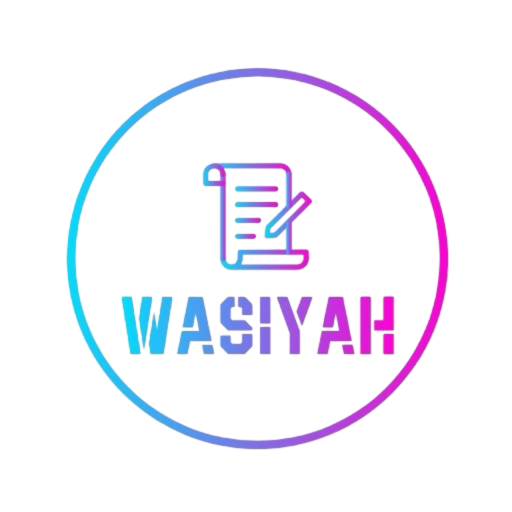
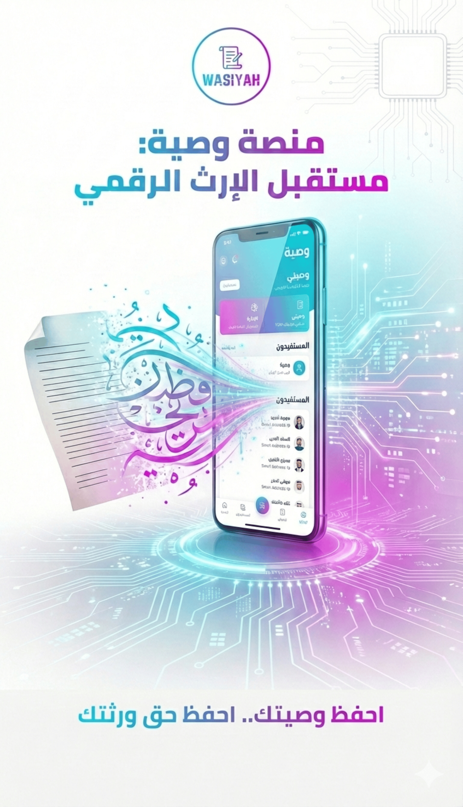
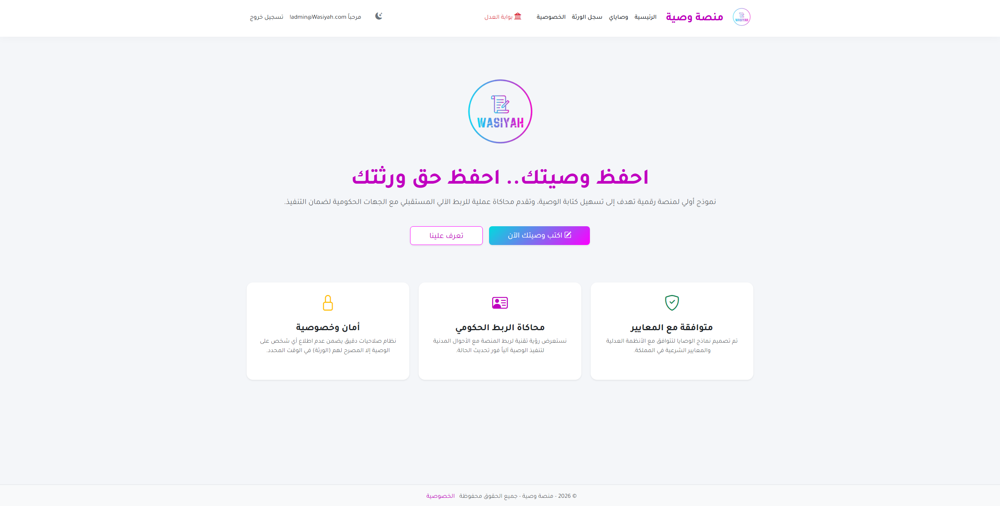
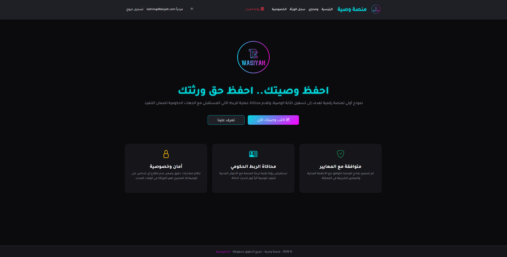
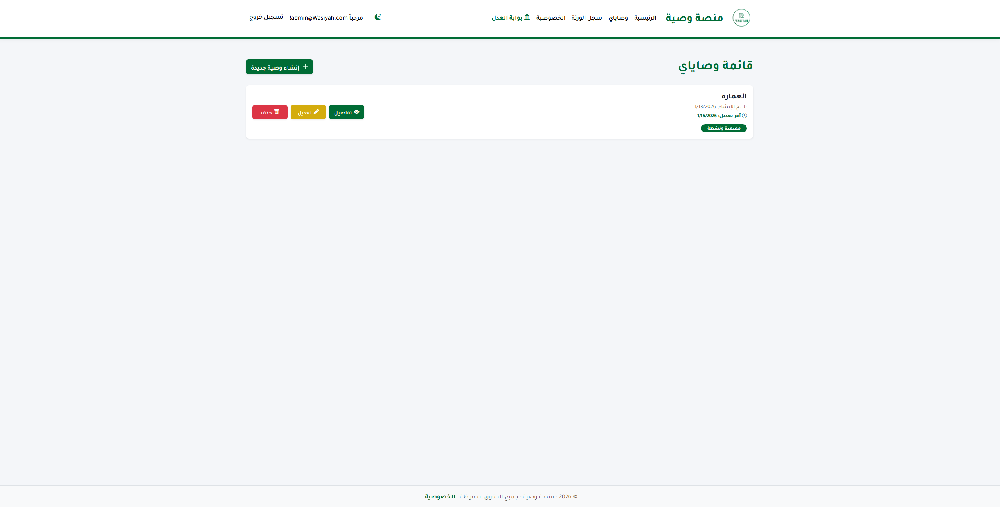
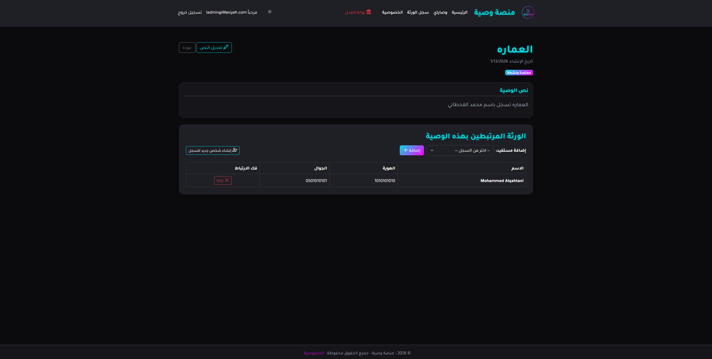
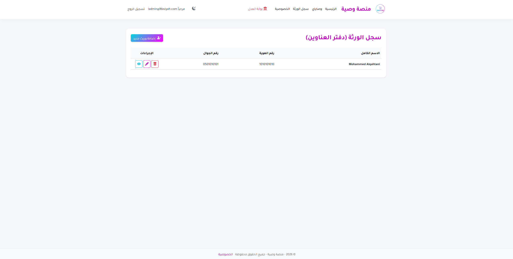
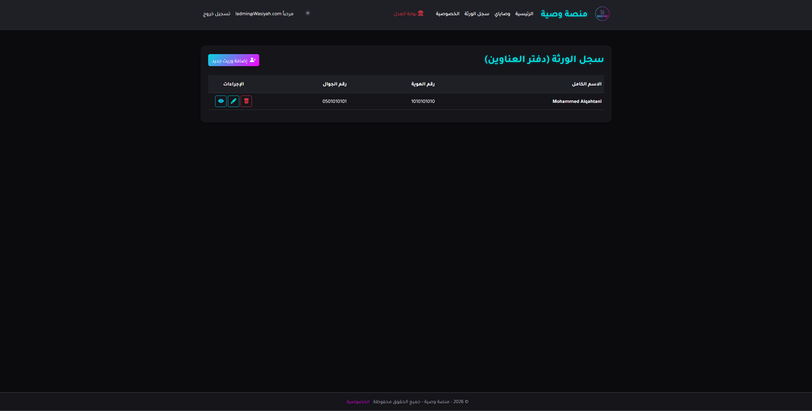
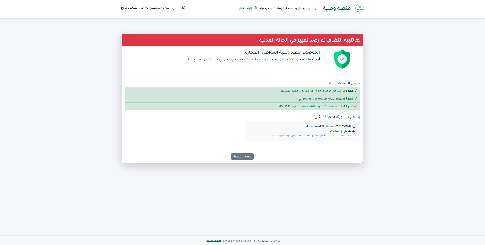
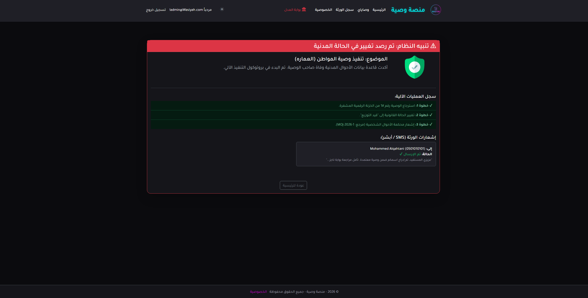

  

<h1 align="center">Wasiyah (منصة وصية)</h1>
<h3 align="center">A Next-Gen Digital Inheritance & GovTech Platform</h3>

  
  
  
  

  <strong>⚠️ Note:</strong> This repository is a portfolio showcase. The source code is private to protect intellectual property.

---

## 🌟 Project Vision

**Wasiyah** is a secure GovTech/FinTech web application designed to digitize the traditional inheritance process in Saudi Arabia. It serves as a foundational prototype for a future ecosystem where wills are drafted digitally, secured via encryption, and executed automatically through integration with the Ministry of Justice and Civil Affairs.

### Arabic Vision:
> منصة رقمية متكاملة تهدف إلى إدارة وتوثيق الوصايا وسجلات المستفيدين إلكترونياً، لضمان حفظ الحقوق وتسهيل الإجراءات.

---

## 🎨 The Poster

  

---

## 📸 UI/UX Gallery (Light vs Dark Mode)

The application features a fully responsive **Bilingual (RTL)** interface with a persistent **Theme Switcher** utilizing LocalStorage and CSS variables for a seamless user experience.

| Feature | Light Mode | Dark Mode |
|---------|------------|-----------|
| **Landing Page** (Modern SaaS Design) |  |  |
| **Will Details** (Complex Many-to-Many Linking) |  |  |
| **Smart Address Book** (Independent Beneficiary Data) |  |  |
| **Government Portal** (Simulation & Execution) |  |  |

---

## 💡 Key Technical Innovations

### 1. Complex Database Architecture (Many-to-Many)

Unlike simple document editors, **Wasiyah** treats "People" and "Documents" as separate entities.

- **The Problem:** In traditional systems, you have to re-type a son's name in every new document.
- **The Solution:** I implemented a normalized **Many-to-Many Architecture** using a Bridge Entity (`WasiyahBeneficiaries`). This allows a user to create a beneficiary once in their "Address Book" and link/unlink them to multiple wills dynamically without data redundancy.

### 2. Government Integration Simulation (The "Killer Feature")

The project goes beyond CRUD to simulate a real-world GovTech scenario:

- **Trigger:** An Admin Dashboard simulating the Civil Affairs API.
- **Logic:** When a "Death Status" is reported, the system uses Entity Framework Core Eager Loading (`.Include().ThenInclude()`) to fetch the Active Will and all linked beneficiaries in a single optimized query.
- **Execution:** It instantly triggers an automated protocol to notify heirs via simulated SMS and update the legal status of the document.

### 3. Security & Access Control

- **Data Isolation:** Implemented strict query filtering (`.Where(w => w.UserId == currentUserId)`) at the Controller level to ensure users can never access data belonging to others, even by manipulating URLs.
- **Role-Based Access Control (RBAC):** The Government Portal is secured via `[Authorize(Roles = "Admin")]`, ensuring it is invisible and inaccessible to standard citizens.

---

## 🔮 Future Roadmap & Scalability

This MVP is architected to scale into a production system:

- **API Integration:** Replacing the simulation controller with real RESTful calls to Nafath (IAM) and Absher.
- **Blockchain Ledger:** Storing will hashes on a private Hyperledger network to ensure immutability and prevent tampering.

---

## 📬 Contact

If you are interested in the technical architecture or the business potential of **Wasiyah**, feel free to reach out.

**Developer:** Abdulwahab Alnemer  
**Bootcamp:** Tuwaiq Academy - Software Development

---
